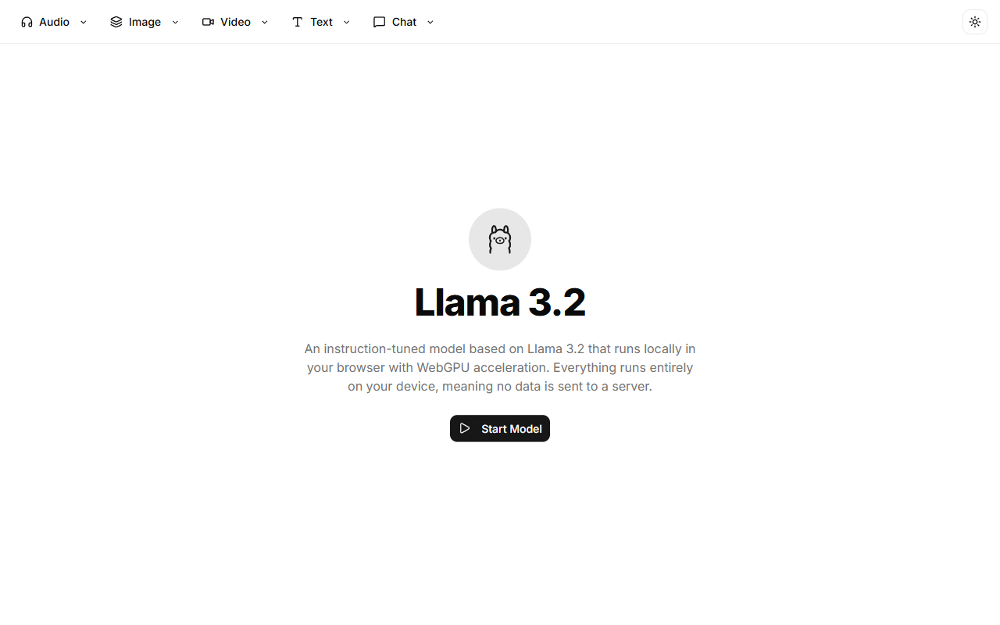

# React Local AI Apps

Welcome to **React Local AI Apps**, a unified platform containing multiple fully local AI applications. These apps run entirely in your browser, ensuring maximum privacy and zero API costs.

Built with **React**, **TypeScript**, **Vite**, and **Shadcn UI**, this repository leverages libraries like `@huggingface/transformers` to bring powerful AI capabilities directly to your device.

## Available Apps

### [Background Remover](src/apps/background-remover/README.md)

Remove the background from images locally.

### [DeepSeek](src/apps/deepseek/README.md)

Chat with the DeepSeek language model entirely in your browser.

### [Image Classifier](src/apps/image-classifier/README.md)

Classify images into different categories.

### [Image Depth](src/apps/image-depth/README.md)

Estimate depth from 2D images.

### [Llama 3](src/apps/llama3/README.md)

Chat with the Llama 3 language model locally.

### [Object Detection](src/apps/object-detection/README.md)

Detect and bound objects in images.

### [Qwen 3](src/apps/qwen3/README.md)

Interact with the Qwen 3 language model.

### [Local Scribe](src/apps/scribe/README.md)

Transcribe audio directly in your browser using local AI.

### [Text to Music](src/apps/text-to-music/README.md)

Generate music from text prompts.

### [Tokenizer Playground](src/apps/tokenizer-playground/README.md)

Playground for testing and understanding tokenizers.

### [Translate (Gemma)](src/apps/translate-gemma/README.md)

Translate text using the Gemma model.

### [Video Captioning](src/apps/video-captioning/README.md)

Automatically generate captions for videos.

### [Voice Cloning](src/apps/voice-cloning/README.md)

Clone voices locally in the browser.

## Screenshots Showcase

Below are some highlights from our applications:




## Getting Started

### Prerequisites

- Node.js installed

### Installation

```bash
npm install
```

### Development

Run the dev server:

```bash
npm run dev
```

## Technologies Used

- React 19
- Vite
- Tailwind CSS
- Shadcn UI
- Transformers.js
