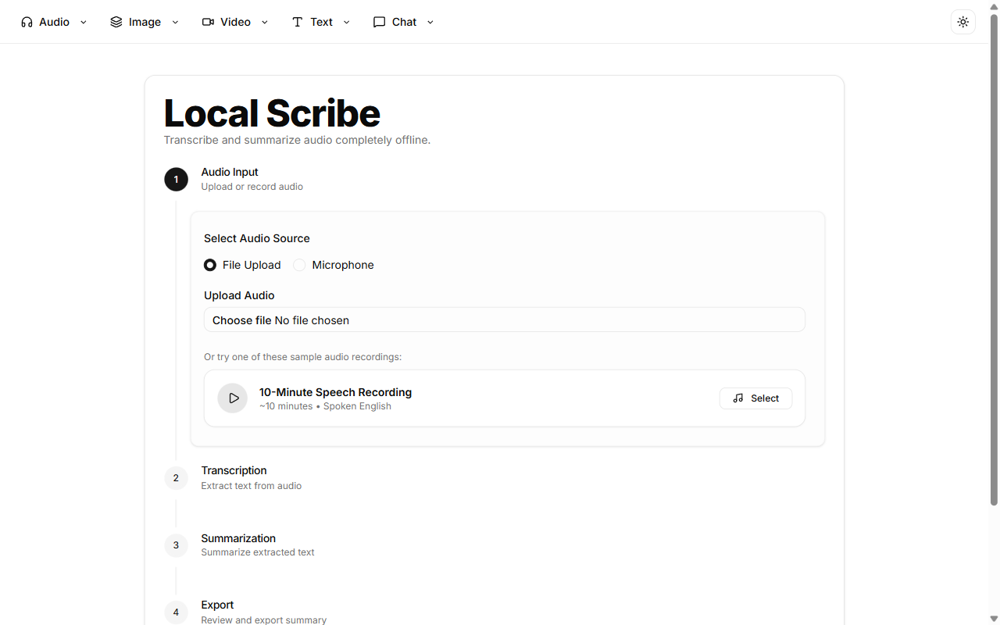
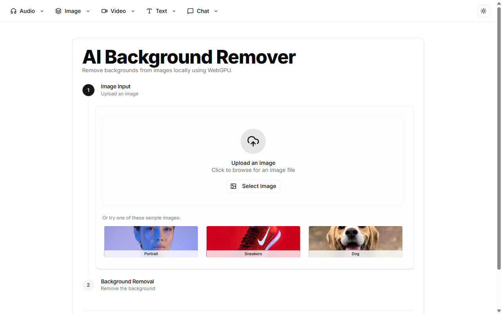
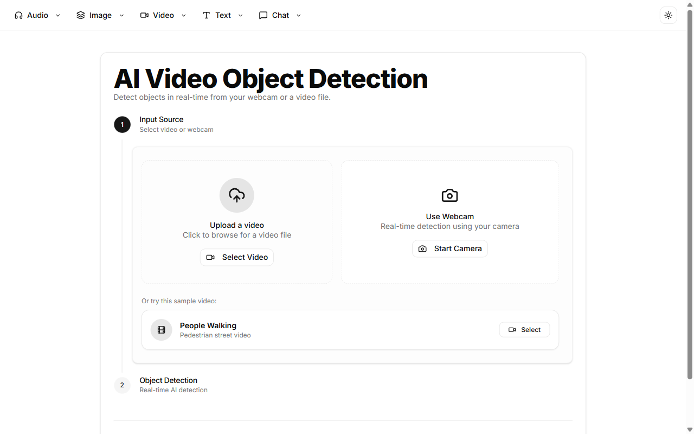
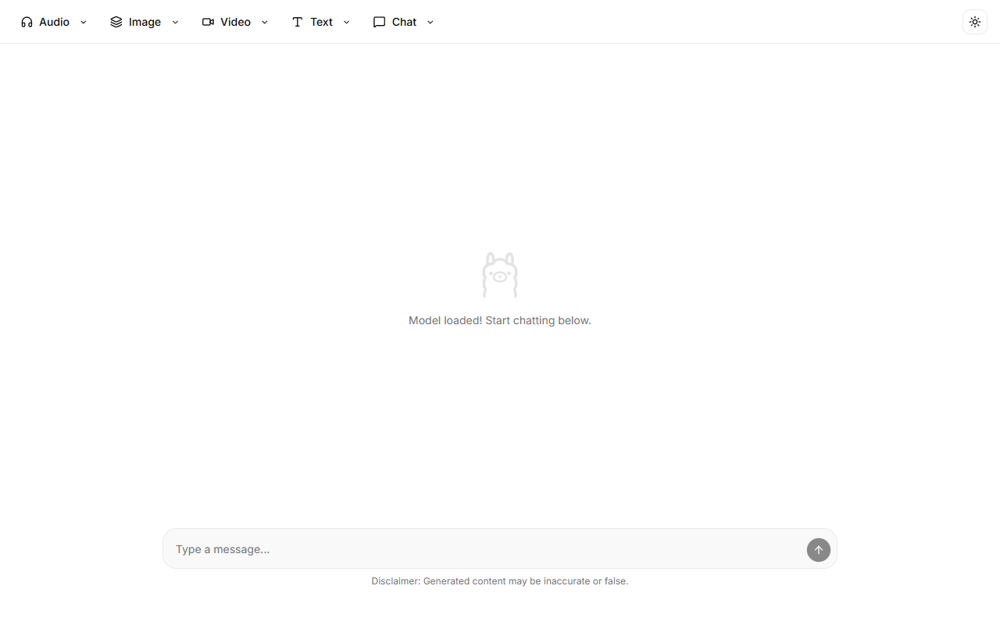

# React Local AI Apps

Welcome to **React Local AI Apps**, a unified platform containing multiple fully local AI applications. These apps run entirely in your browser, ensuring maximum privacy and zero API costs.

Built with **React**, **TypeScript**, **Vite**, and **Shadcn UI**, this repository leverages libraries like `@huggingface/transformers` to bring powerful AI capabilities directly to your device.

## Available Apps

### Audio

- **[Local Scribe](src/apps/scribe/README.md)**: Transcribe audio directly in your browser using local AI.
- **[Text to Music](src/apps/text-to-music/README.md)**: Generate music from text prompts.
- **[Voice Cloning](src/apps/voice-cloning/README.md)**: Clone voices locally in the browser.

### Image

- **[Image Classifier](src/apps/image-classifier/README.md)**: Classify images into different categories.
- **[Background Remover](src/apps/background-remover/README.md)**: Remove the background from images locally.
- **[Image Depth](src/apps/image-depth/README.md)**: Estimate depth from 2D images.

### Video

- **[Object Detection](src/apps/object-detection/README.md)**: Detect and bound objects in images.
- **[Video Captioning](src/apps/video-captioning/README.md)**: Automatically generate captions for videos.
- **[Video Describer](src/apps/video-describer/README.md)**: Real-time visual scene narration and audio description powered by local AI.

### Text

- **[Semantic Search (RAG)](src/apps/semantic-search/README.md)**: Search documents with natural language and chat with local RAG.
- **[Tokenizer Playground](src/apps/tokenizer-playground/README.md)**: Playground for testing and understanding tokenizers.
- **[Translate (Gemma)](src/apps/translate-gemma/README.md)**: Translate text using the Gemma model.

### Chat

- **[Qwen 3 - 0.6B](src/apps/qwen3/README.md)**: Interact with the Qwen 3 language model.
- **[DeepSeek R1 - 1.5B](src/apps/deepseek/README.md)**: Chat with the DeepSeek language model entirely in your browser.
- **[Llama 3.2 - 1B](src/apps/llama3/README.md)**: Chat with the Llama 3 language model locally.
- **[Gemma 4 - E2B](src/apps/gemma4/README.md)**: Chat with the Gemma 4 language model locally.

## Screenshots Showcase

Below are some highlights from the applications:






## Getting Started

### Prerequisites

- Node.js installed

### Installation

```bash
npm install
```

### Development

Run the dev server:

```bash
npm run dev
```

### Docker

Build and run using Docker Compose:

```bash
npm run docker
```

The application will be accessible at `http://localhost:8080` by default. You can override the port by setting the `PORT` environment variable (e.g. `PORT=3000 npm run docker` or defining `PORT=3000` in `.env`).

## Technologies Used

- React 19
- Vite
- Tailwind CSS
- Shadcn UI
- Transformers.js
